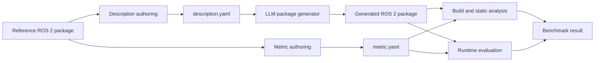

# ROS 2 Code Generation Benchmark for Large Language Models

This repository provides a benchmark for evaluating whether a large language model (LLM) can generate a functionally correct ROS 2 package from a structured natural-language description.

The benchmark focuses on **functional equivalence**, not source-code similarity. A generated package may use a different node decomposition, algorithm, timer period, or implementation style when those details are not part of the observable contract. It passes when it implements the required behavior and interoperates through the required ROS 2 interfaces.

> **Status:** The benchmark format is being stabilized and benchmark cases are being added. The current repository defines the artifact structure, description format, metric format, and evaluation principles.

## Benchmark Unit

Each benchmark case contains three core benchmark artifacts:

| Artifact | Purpose | Visible to the code generator |
| --- | --- | --- |
| `description.yaml` | Defines the package intent, observable functional requirements, and ROS 2 interface contract. | Yes |
| `metric.yaml` | Defines named evaluation dimensions and independently checkable pass criteria. | No |
| `reference/` | Contains the original ROS 2 package used to derive and verify the description and metrics. | No |

The reference package is evidence for benchmark authors and evaluators. It is not a source template that the generated implementation must reproduce.

## Evaluation Principle

The benchmark asks the following question:

> Given only the structured description, did the LLM generate a ROS 2 package with the intended observable behavior and interoperability contract?

Evaluation follows these rules:

1. Do not require source-code identity with the reference package.
2. Accept alternative implementations that satisfy the same observable behavior.
3. Require exact topic, service, action, TF, parameter, and launch contracts only when they are specified in `description.yaml`. The metric may evaluate these contracts but must not introduce requirements hidden from the code generator.
4. Generalize incidental implementation details such as a `100 ms` timer to periodic execution unless the exact value is a public requirement.
5. Derive every pass criterion from reachable reference-package behavior and cite the relevant source evidence.
6. Do not award credit for code that merely contains matching names without implementing the associated behavior.

## Evaluation Workflow



Only `description.yaml` is provided to the package generator. The metric and reference package remain hidden during generation.

## Repository Layout

```text
.
├── README.md
├── benchmarks/
│   ├── README.md
│   └── <package_name>/
│       ├── description.yaml
│       ├── metric.yaml
│       └── reference/
│           ├── package.xml
│           └── ...
└── templates/
    ├── description.yaml
    └── metric.yaml
```

Each package directory below `benchmarks/` is one independently evaluated benchmark case. The package name declared in `description.yaml` must match the reference package's `package.xml`.
