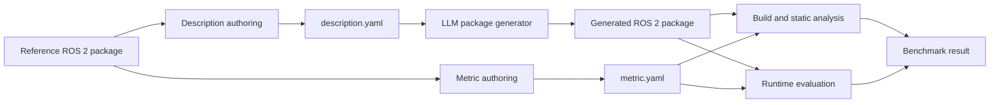

# ROS 2 Code Generation Benchmark for Large Language Models

This repository provides a benchmark for evaluating whether a large language model (LLM) can generate a functionally correct ROS 2 package from a structured natural-language description.

The benchmark focuses on **functional equivalence**, not source-code similarity. A generated package may use a different node decomposition, algorithm, timer period, or implementation style when those details are not part of the observable contract. It passes when it implements the required behavior and interoperates through the required ROS 2 interfaces.

> **Status:** The benchmark format is being stabilized and benchmark cases are being added. The repository currently defines the artifact structure, description and metric formats, and preliminary evaluation principles; the detailed evaluation protocol is still under development.

## Benchmark Unit

Each benchmark case contains three core benchmark artifacts:

| Artifact | Purpose | Visible to the code generator |
| --- | --- | --- |
| `description.yaml` | Defines the package intent, observable functional requirements, and ROS 2 interface contract. | Yes |
| `metric.yaml` | Defines named evaluation dimensions and independently checkable pass criteria. | No |
| `reference/` | Contains the original ROS 2 package used to derive and verify the description and metrics. | No |

The reference package is evidence for benchmark authors and evaluators. It is not a source template that the generated implementation must reproduce.

## Evaluation Principle

The benchmark asks the following question:

> Given only the structured description, did the LLM generate a ROS 2 package with the intended observable behavior and interoperability contract?

Evaluation follows these rules:

1. Do not require source-code identity with the reference package.
2. Accept alternative implementations that satisfy the same observable behavior.
3. Require exact topic, service, action, TF, parameter, and launch contracts only when they are specified in `description.yaml`. The metric may evaluate these contracts but must not introduce requirements hidden from the code generator.
4. Generalize incidental implementation details such as a `100 ms` timer to periodic execution unless the exact value is a public requirement.
5. Derive every pass criterion from reachable reference-package behavior and cite the relevant source evidence.
6. Do not award credit for code that merely contains matching names without implementing the associated behavior.

## Evaluation Workflow



Only `description.yaml` is provided to the package generator. The metric and reference package remain hidden during generation.

## Description Example

The following description was derived from `dummy_sensors`, one of the three ROS 2 packages in the `dummy_robot` demo collection. The package provides two nodes that generate synthetic laser-scan and joint-state data.

```yaml
intent:
  package_name: dummy_sensors
  summary: >-
    Provides standalone dummy ROS 2 sensor nodes that continuously publish
    simulated laser-scan and joint-state data for a simple robot.
  scope: >-
    This package generates synthetic sensor messages; robot visualization,
    transform publication, and consumption of the sensor data are external
    responsibilities.

functional_requirements:
  - id: FR-1
    text: >-
      The dummy_laser node continuously publishes timestamped simulated laser
      scans with varying range measurements in the
      single_rrbot_hokuyo_link frame.
  - id: FR-2
    text: >-
      The dummy_joint_states node continuously publishes timestamped joint
      states for single_rrbot_joint1 and single_rrbot_joint2 with synchronized
      varying position values.

interfaces:
  nodes:
    - name: dummy_laser
      responsibility: Publishes simulated planar laser range data.
      topics:
        - name: scan
          type: sensor_msgs/msg/LaserScan
          direction: publish
          purpose: >-
            Provides simulated laser-scan ranges stamped in the
            single_rrbot_hokuyo_link frame.
    - name: dummy_joint_states
      responsibility: Publishes simulated positions for the dummy robot joints.
      topics:
        - name: joint_states
          type: sensor_msgs/msg/JointState
          direction: publish
          purpose: >-
            Provides timestamped positions for single_rrbot_joint1 and
            single_rrbot_joint2.
```

### How to Read the Description

- `intent` identifies the package and summarizes its purpose and responsibility boundary.
- `functional_requirements` states the observable behaviors that a generated package must reproduce. It does not prescribe incidental implementation details such as the original loop rates or trigonometric formulas.
- `interfaces.nodes` records each implemented ROS 2 node and nests the graph resources used by that node. In this example, both resources are published topics.
- Interface categories that do not apply, such as services, actions, TF lookups, parameters, launch arguments, and external nodes, are omitted instead of being filled with placeholder values.

## Repository Layout

```text
.
├── README.md
├── benchmarks/
│   ├── README.md
│   └── <package_name>/
│       ├── description.yaml
│       ├── metric.yaml
│       └── reference/
│           ├── package.xml
│           └── ...
└── templates/
    ├── description.yaml
    └── metric.yaml
```

Each package directory below `benchmarks/` is one independently evaluated benchmark case. The package name declared in `description.yaml` must match the reference package's `package.xml`.
